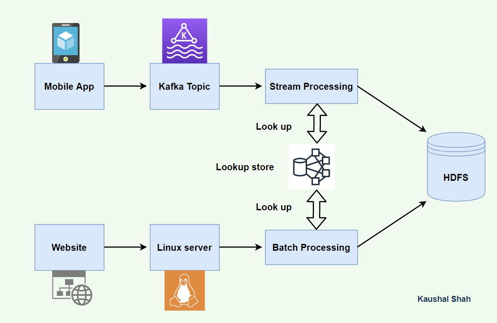

# short-video-platform-big-data-analytics

# Introduction
A leading short video company is facing challenges in enhancing its revenue and understanding the users so it wants to take help of Big Data Ecosystem to analyze large amounts of data received from varieties of sources, namely through mobile app and website. This analysis will help them to track the behavior of users so that to customize offers for them to buy paid subscription and also calculate royalties to the video creators do that to make them create more videos, this in turn will enhance their revenues.

# Project Pipeline

# Project Goal
The goal the project is to create data pipelines for the short video company which will make the company make appropriate business strategies to enhance their revenue by analyzing users and video data to send offers and royalties to users respectively.

# Data Flow Architecture / Process Flow
1.	A Linux file server receives data files in form of xml and csv periodically after every 2 hours. These two files are coming from the website based on user   interaction methodology.
2.	There is a real time stream following as well from the mobile devices from the mobile app logs in form of json going to kafka topic. 
3.	The file data and stream data is validated, enriched and processed before loading into HDFS. There is a  lookup table in this processing logic as well.- SPARK Streaming is the most suited with lookups on Hbase. Spark streaming because we can use the Spark framework for both batch and real time queries that can make the solution operationally easier. HBASE is used for lookup due to the ability to fetch very fast by rowkey based lookups.
4.	Finally data landed to HDFS needs to be analyzed by some analytical queries.-SPARK- Analytical queries can be done on Spark due to better performance and ability to control the jobs.

# Dataset Explanation & Schema
1. Data coming from web applications reside in local directory and has csv and  xml format.
2. Data coming from mobile applications stream has Json.
3. Data present in lookup directory should be used in HBase.

Data files contain below fields.

## Column Name/Field Name Column Description/Field Description

●	User_id Unique identifier of every user
●	Video_id Unique identifier of every video
●	Creator_id Unique identifier of the lead creator of the video
●	Timestamp Timestamp when the video was generated
●	minutes_played minutes between video started to play video was stopped
●	Geo_cd Can be 'A' for America region, 'AP' for Asia Pacific region, 'J' for Japan region, 'E' for europe and 'AU' for australia region
●	Creator_id Unique identifier of the Creator from where the video was played
●	Video_end_type How the video was terminated.

0 means completed successfully
1 means video was skipped
2 means video was paused
3 means other type of failure like device issue, network error etc.
●	Liked- 
 -true means video was liked (the like button was clicked)
 -false means video was not liked (the like button was not clicked)
●	Disliked
 -true means video was disliked (the dislike button was clicked)
 -false means video was not disliked (the dislike button was not clicked)
 
 
## LookUp Tables
There are some existing look up tables present in NoSQL databases. They play an important role in
data enrichment and analysis.

## Table Name Description
●	Creator_geo_map (Creator-geocd.txt) Contains mapping of a geo_cd with Creator_id
●	subscribed_users(user-subscn.txt) Contains user_id, subscription_start_date andsubscription_end_date. Contains details only for subscribed users
●	video_creator_map (video-creator.txt) Contains mapping of video_id with creator_id
●	users_creator(user-creator.txt) Contains an array of creator_id(s) followed by a user_id

